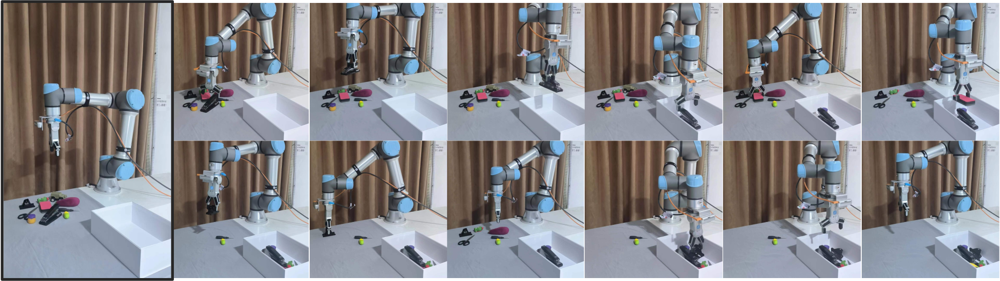

# <p align=center>grasp-encyclopedia</p>



[](https://github.com/sindresorhus/awesome) [](https://GitHub.com/Naereen/StrapDown.js/graphs/commit-activity) [](http://makeapullrequest.com)

A benchmark platform for robot grasp detection, integrating some classic grasp algorithms.


- [grasp-encyclopedia](#grasp-encyclopedia)
- [项目简介](#项目简介)
- [Review](#review)
- [2D-Grasp](#2d-grasp)
  - [Paper](#paper)
  - [Code](#code)
- [6DoF-Grasp](#6dof-grasp)
  - [Paper](#paper-1)
    - [PointCloud](#pointcloud)
    - [RGB+PointCloud](#rgbpointcloud)
    - [voxel](#voxel)
    - [2D-3D](#2d-3d)
- [Datasets](#datasets)
- [Version](#version)

# 项目简介
Grasp-encyclopedia 致力于打造一个抓取算法的通用平台，该平台将整理并集成历年来抓取领域的里程碑式开源算法。并以该领域几大著名数据集为基础，将算法封装在基于数据集的train-test程序框架中。为需要快速对比不同算法在同一数据集下性能的朋友提供帮助。

# [Review](#Review)
该部分整理了抓取领域的相关综述论文，通过阅读这些论文可以迅速了解抓取领域的发展历程和最新进展。

|论文名称|    内容简介    |发表年份|文章链接|
|---|---|---|---|
|Vision-based Robotic Grasping From Object Localization, Object Pose Estimation to Grasp Estimation for Parallel Grippers: A Review|文章总结了基于视觉的机器人抓取过程中的三个关键任务：对象定位、对象姿态估计和抓取估计，基于这三项任务可以实现物体的2D平面抓取和6DoF抓取。此外总结了基于RGB-D图像输入的传统方法和最新的基于深度学习的方法；相关数据集和最先进方法之间的比较；基于视觉的机器人抓取面临的挑战以及解决这些挑战的未来方向。**是机器人抓取的入门综述论文**|2019|[arXiv](https://arxiv.org/abs/1905.06658)|
|Deep Learning Approaches to Grasp Synthesis: A Review|文章**针对性的梳理了6DoF抓取的发展状况**，并总结四种常见方法：基于采样的方法、直接回归、强化学习和示例方法。|2022|[arXiv](https://arxiv.org/abs/2207.02556)|
|Robotic Grasping from Classical to Modern: A Survey|文章回顾了基于分析和基于学习的机器人抓取方法。亮点是**对于抓取方法的分类比较细致，可以从文章的标题出发快速定位到基于某类技术实现的抓取方法**（例如：平面抓取中基于像素级表示的抓取方法）。|2022|[arXiv](https://arxiv.org/abs/2202.03631)|


# [2D-Grasp](#2D-Grasp)
2D 平面抓取是指目标物体位于平面工作空间上并且机械臂执行自上而下的抓取，这种抓取模式通常被称为 Top-down 抓取。在这种情况下，夹具的初始高度是固定的，并且夹具垂直于抓取平面。因此，抓取信息可以从 6D 简化为 3D，即2D 面内位置和 1D 旋转角度。

## [Paper](#Paper)
|算法简称|论文名称|    算法简介    |输入数据|发表刊物及时间|
|---|---|---|---|---|
|---|Real-Time Grasp Detection Using Convolutional Neural Networks [[paper]](https://arxiv.org/abs/1412.3128), [[code]](https://github.com/tnikolla/robot-grasp-detection)|文章提出了一种基于CNN网络的实时抓取检测方法，将抓取检测当作一阶段目标检测任务进行回归检测。该论文是第一个提出使用神经网络实现抓取检测，作者是CV领域大名鼎鼎的Joseph Redmon。|RGB|ICRA 2015|
|GG-CNN|Learning robust, real-time, reactive robotic grasping [[paper]](https://journals.sagepub.com/doi/full/10.1177/0278364919859066), [[code]](https://github.com/dougsm/ggcnn)|文章提出了一种在深度图上实现像素级抓取检测的方法，轻量化。|D|Robotics: Science and Systems (RSS) 2018|
|GRCNN|Antipodal Robotic Grasping using Generative Residual Convolutional Neural Network [[paper]](https://arxiv.org/abs/1909.04810), [[code]](https://github.com/skumra/robotic-grasping)|文章提出了一种生成残差卷积神经网络(GR ConvNet)模型，使用像素级表示方法进行检测，输出角度、宽度、质量热图矩阵。论文很好的平衡了速度和精度问题，同时给出了机械臂驱动代码，部署友好。|RGB-D|IROS 2020|
|E2E-net|End-to-end Trainable Deep Neural Network for Robotic Grasp Detection and Semantic Segmentation from RGB [[paper]](https://arxiv.org/abs/2107.05287), [[code]](https://github.com/stefan-ainetter/grasp_det_seg_cnn)|文章引入了一种细化模块，实现了抓取检测和语义分割，同时扩展了ORCID数据集。在CNN类型的开源算法里精度比较高。|RGB|ICRA 2021|
|TF-Grasp|When Transformer Meets Robotic Grasping: Exploits Context for Efficient Grasp Detection [[paper]](https://ieeexplore.ieee.org/abstract/document/9810182), [[code]](https://github.com/WangShaoSUN/grasp-transformer)|第一个使用transformer模型实现像素级抓取检测。|RGB-D|IEEE Robotics and Automation Letters 2022|
|SSG|Instance-wise Grasp Synthesis for Robotic Grasping [[paper]](https://arxiv.org/abs/2302.07824), [[code]](https://github.com/HilbertXu/Instance-wise-grasp-synthesis)|文章提出一种单阶段的像素级抓取网络，同时为每个对象生成实例掩码和抓取配置。|RGB-D|ICRA 2023|

## [Code](#Code)
本部分对应源码中的2D-Grasp根目录文件夹，该文件夹中集成了目前项目所整理的全部2D抓取算法。

2D-Grasp文件目录:
```
|-- 2D-Grasp
    |-- Generation-methods
        |-- models
            |-- GRCNN_network
            |-- TF_network
            |-- _init_.py
            |-- common.py
        |-- output
            |-- ...
        |-- utils
            |-- ...
        |-- main.py
        |-- net_init.py
        |-- opts.py
        |-- traning.py
        |-- visualise_grasp_rectangle.py
        |-- visualise_heatmaps.py
        |-- requirements.txt
        |-- README.md
    
```
文件说明：

* 集成了一类Generation逐像素检测方法，包括GRCNN、TF-Grasp。

# [6DoF-Grasp](#6DoF-Grasp)
6DoF抓取是指夹具可以从三维空间中以任意一角度靠近并抓取物体，因为可以在 X, Y, Z 
坐标轴上平移和旋转，因此有 6 个接近自由度。6DoF 的抓取信息通常被表示成物体的 6D 
位姿，具体的求解内容为旋转矩阵R和平移向量T。在一定程度上 6DoF 抓取问题可以等价为物体 6 自由度位姿估计。
## [Paper](#Paper)

目前的6DoF抓取检测方法种类繁多，因此决定以**网络处理的数据类型**为界定(例如: 点云抓取网络)对当前的方法进行一级分类

### [PointCloud](#PointCloud&3Dmodel)

该种类方法的网络架构都是点云/3D模型处理网络,点云数据是用RGB-D图像中转化而来。 注意：下面介绍到的Dex-net方法比较特殊。

|算法简称|论文名称|    算法简介    |发表刊物及时间|
|---|---|---|---|
|Dex-Net|Dex-net1.0 & Dex-net2.0 & Dex-net3.0 & Dex-net4.0 [[paper and code]](http://berkeleyautomation.github.io/dex-net/#dexnet_4)|提出4个版本的6DoF抓取算法，**延续性强**，是6DoF领域发展历程的一个缩影。其中1.0为传统的解析法。2.0基于深度学习对平行板抓取配置进行质量评估，3.0针对吸盘进行设计，4.0结合了2.0和3.0两个算法|ICRA / RSS / CoRL / Science Robotics|
|PointNetGPD|PointNetGPD: Detecting Grasp Configurations from Point Sets [[paper]](https://arxiv.org/abs/1809.06267), [[code]](https://lianghongzhuo.github.io/PointNetGPD/)|论文提出了一种端到端的轻量化点云神经网络，用来在输入部分稀疏点云的情况下检测抓取姿势。|ICRA 2019|
|GraspNet-1Billion|GraspNet-1Billion: A Large-Scale Benchmark for General Object Grasping [[paper]](https://openaccess.thecvf.com/content_CVPR_2020/html/Fang_GraspNet-1Billion_A_Large-Scale_Benchmark_for_General_Object_Grasping_CVPR_2020_paper.html), [[code]](https://github.com/graspnet/graspnet-baseline)|提出了一个具有**10亿级抓取姿势的RGB-D数据集**，该数据集应该是目前真实场景中最大的数据集。且能够同时应用到2D抓取和6DoF抓取中。文章中详细介绍了数据集的制作方式并提出了一个基于点云数据的抓取检测方法，**不论是数据集的制作还是基于点云的网络框架的提出都很有借鉴意义**。|CVPR 2020|
|---|Towards Scale Balanced 6-DoF Grasp Detection in Cluttered Scenes [[paper]](https://arxiv.org/abs/2212.05275), [[code]](https://github.com/mahaoxiang822/Scale-Balanced-Grasp)|论文重点关注 6-DoF 抓取检测中存在尺度不平衡的特征学习问题，并提出了一种新方法来特别解决处理小规模样本的困难，**是一种在GraspNet-1Billion框架上的网络优化**。|CoRL 2022|


### [RGB+PointCloud](#PointCloud)

该种类的方法结合了处理RGB的二维神经网络和点云网络，是一种综合的解决方案。**这种策略近几年都有论文，是一个可以研究的小领域，但是开源代码比较少。研究重点是如何将一个三维空间下的抓取问题进行解耦**。

|算法简称|论文名称|    算法简介    |发表刊物及时间|
|---|---|---|---|
|RGB Matters|RGB Matters: Learning 7-DoF Grasp Poses on Monocular RGBD Images [[paper]](chrome-extension://ibllepbpahcoppkjjllbabhnigcbffpi/), [[code]](https://github.com/graspnet/graspnet-baseline) |论文提出一种7DoF预测方法，将抓取问题解耦成夹爪在三维空间下的旋转角度、夹爪张开宽度和距离。将角度问题转换成**基于RGB图像的CNN多分类问题**; 同时基于深度图中的点云数据使用采样的方式获取合适的夹爪宽度和距离。|ICRA 2021|

### [voxel](#voxel)

该类方法使用体素网格描述抓取场景并实现预测6DoF抓取结果, 这部分的解决方案多和**主动式三维场景重建**相关。

|算法简称|论文名称|    算法简介    |发表刊物及时间|
|---|---|---|---|
|VGN|Volumetric Grasping Network: Real-time 6 DOF Grasp Detection in Clutter [[paper]](https://arxiv.org/abs/2101.01132), [[code]](https://github.com/ethz-asl/vgn)|论文提出了体积抓取网络 (VGN) 接受场景的截断符号距离函数 (TSDF) 表示，并直接输出体素网格的预测抓取质量以及相关的夹具方向和开口宽度。|CoRL 2020|
|GIGA|Synergies Between Affordance and Geometry: 6-DoF Grasp Detection via Implicit Representations [[paper]](https://arxiv.org/abs/2104.01542), [[code]](https://sites.google.com/view/rpl-giga2021)|论文采用深度隐式函数同时实现了3D重建和抓取检测。|arXiv 2021|
|VPP|Closed-Loop Next-Best-View Planning for Target-Driven Grasping [[paper]](https://arxiv.org/abs/2207.10543), [[code]](https://github.com/ethz-asl/active_grasp)|论文提出了一种闭环次佳视图规划器，可根据遮挡的对象部分驱动探索，最后获取最优抓取结果。|IROS 2022|
### [2D-3D](#Pose-Estimation)

在任务类型上, 基于6DoF的抓取检测接近于位姿估计(Pose Estimation), 或者说抓取检测是位姿估计的一个下游任务和具体应用。
因此有一部分学者将位姿估计领域相关的进展迁移到抓取检测领域, 形成了一类6DoF抓取检测解决方案。

该类方案的重要特征为: **不使用点云，仅在图像层面完成预测，然后使用其它方法获取最终的RT结果**。

|算法简称|论文名称|    算法简介    |发表刊物及时间|
|---|---|---|---|
|Keypoint-GraspNet|Keypoint-GraspNet: Keypoint-based 6-DoF Grasp Generation from the Monocular RGB-D input [[paper]](https://arxiv.org/abs/2209.08752), [[code]](https://github.com/ivalab/KGN)|论文提出了对单目RGB-D图像进行二维关键点检测，然后基于获得的2D-3D关键点使用PnP恢复可行6DoF抓取姿势。|ICRA 2023|


# [Datasets](#Datasets)

|名称|简介|应用领域|
|---|---|---|
|[Cornell Dataset](http://pr.cs.cornell.edu/grasping/rect_data/data.php)|平面抓取检测领域中最为常见的数据集之一，由1035 张 RGB-D 图像组成，其中每张图像的分辨率为 640*480，数据集中包含了 240 个不同的物体。|平面抓取|
|[Jacquard Dataset](https://jacquard.liris.cnrs.fr/)|一个典型的2D抓取检测数据集，内部包含54k张GRB-D图像和110万个抓取实例。|平面抓取|
|[YCB Dataset](https://www.ycbbenchmarks.com/object-models/)|一个非常经典的6DoF抓取检测数据集，同时也可以用来做位姿估计等。由日常生活中的物体组成。数据集提供了600张RGB-D图像和对应的分割掩码、标定信息, 此外还有纹理映射的3D mesh 模型。|6DoF抓取检测|
|[GraspNet 1Billion Dataset](https://graspnet.net/datasets.html)|一个大型的真实场景多目标抓取数据集， 拥有97280张RGB-D图像, 190个抓取场景, 超过10亿个抓取姿势。|平面抓取/6DoF抓取|

数据集放置方式：

将数据集下在后，统一放置在根目录下的`Datasets`文件夹内。目前以cornell数据集为例，创建了该数据集的子文件夹，并将部分图像放置作为后续代码的逻辑测试。


# [Version](#Version)
* updata：2023/11/18：更新部分6DoF抓取论文和几个相关的数据集。
* update：2023/11/04：完成GRCNN和TF-Grasp算法的集成，包括train和visual功能；并上传Cornell数据集的部分图像用来测试程序。